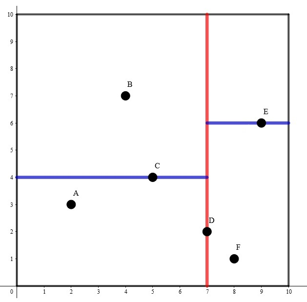
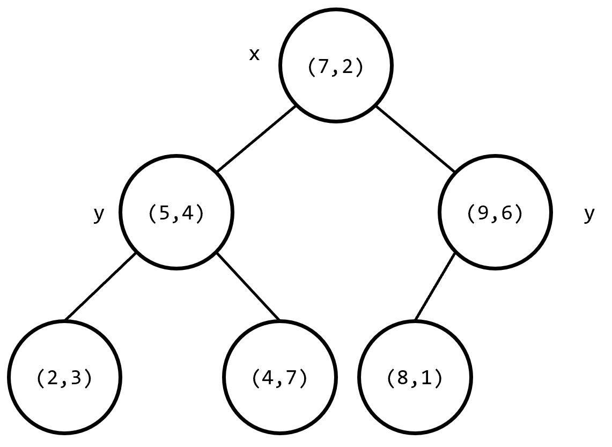

k-D Tree (KDT, k-Dimension Tree) 是一种可以高效处理 k 维空间信息的数据结构。在结点数 n 远大于 $2^k$ 时，应用 k-D Tree 的时间效率很好。在算法竞赛的题目中，一般有 k=2。在本页面分析时间复杂度时，将认为 k 是常数。

## 建树

k-D Tree 具有二叉搜索树的形态，二叉搜索树上的每个结点都对应 k 维空间内的一个点。其每个子树中的点都在一个 k 维的超长方体内，这个超长方体内的所有点也都在这个子树中。

假设我们已经知道了 k 维空间内的 n 个不同的点的坐标，要将其构建成一棵 k-D Tree，步骤如下：

1. 若当前超长方体中只有一个点，返回这个点。
2. 选择一个维度，将当前超长方体按照这个维度分成两个超长方体。
3. 选择切割点：在选择的维度上选择一个点，这一维度上的值小于这个点的归入一个超长方体（左子树），其余的归入另一个超长方体（右子树）。
4. 将选择的点作为这棵子树的根节点，递归对分出的两个超长方体构建左右子树，维护子树的信息。

为了方便理解，我们举一个 k=2 时的例子。



其构建出 k-D Tree 的形态可能是这样的：



其中树上每个结点上的坐标是选择的分割点的坐标，非叶子结点旁的 x 或 y 是选择的切割维度。

这样的复杂度无法保证。对于 2,3 两步，我们提出两个优化：

1. 轮流选择 k 个维度，以保证在任意连续 k 层里每个维度都被切割到。
2. 每次在维度上选择切割点时选择该维度上的 中位数，这样可以保证每次分成的左右子树大小尽量相等。

可以发现，使用优化 2 后，构建出的 k-D Tree 的树高最多为 $\log n+O(1)$。

现在，构建 k-D Tree 时间复杂度的瓶颈在于快速选出一个维度上的中位数，并将在该维度上的值小于该中位数的置于中位数的左边，其余置于右边。如果每次都使用 `sort` 函数对该维度进行排序，时间复杂度是 $O(n\log^2 n)$ 的。事实上，单次找出 n 个元素中的中位数并将中位数置于排序后正确的位置的复杂度可以达到 O(n)。

我们来回顾一下快速排序的思想。每次我们选出一个数，将小于该数的置于该数的左边，大于该数的置于该数的右边，保证该数在排好序后正确的位置上，然后递归排序左侧和右侧的值。这样的期望复杂度是 $O(n\log n)$ 的。但是由于 k-D Tree 只要求要中位数在排序后正确的位置上，所以我们只需要递归排序包含中位数的 一侧。可以证明，这样的期望复杂度是 O(n) 的。在 `algorithm` 库中，有一个实现相同功能的函数 `nth_element()`，要找到 s[l] 和 s[r] 之间的值按照排序规则 cmp 排序后在 s[mid] 位置上的值，并保证 s[mid] 左边的值小于 s[mid]，右边的值大于 s[mid]，只需写 `nth_element(s+l,s+mid,s+r+1,cmp)`。

借助这种思想，构建 k-D Tree 时间复杂度是 $O(n\log n)$ 的。

## 高维空间上的操作

### 查询

在查询高维矩形区域内的所有点的一些信息时，记录每个结点子树内每一维度上的坐标的最大值和最小值。如果当前子树对应的矩形与所求矩形没有交点，则不继续搜索其子树；如果当前子树对应的矩形完全包含在所求矩形内，返回当前子树内所有点的权值和；否则，判断当前点是否在所求矩形内，更新答案并递归在左右子树中查找答案。

``` java
int query(int p) {
    if (p == 0) return 0;
    boolean flag = false;
    for (int k = 0; k < 2; k++) {
        if (!(l.x[k] <= t[p].L[k] && t[p].R[k] <= h.x[k])) {
            flag = true;
        }
    }
    if (!flag) return t[p].sum;
    for (int k = 0; k < 2; k++) {
        if (t[p].R[k] < l.x[k] || h.x[k] < t[p].L[k]) {
            return 0;
        }
    }
    int ans = 0;
    flag = false;
    for (int k = 0; k < 2; k++) {
        if (!(l.x[k] <= t[p].x[k] && t[p].x[k] <= h.x[k])) {
            flag = true;
        }
    }
    if (!flag) ans = t[p].v;
    ans += query(t[p].l) + query(t[p].r);
    return ans;
}

```

### 插入/删除

如果维护的这个 k 维点集是可变的，即可能会插入或删除一些点，此时 k-D Tree 的平衡性无法保证。由于 k-D Tree 的构造，不能支持旋转，类似与 FHQ Treap 的随机优先级也不能保证其复杂度。对此，有两种比较常见的维护方法。

> 很多人会使用替罪羊树结构来维护。但是注意到在刚才的复杂度分析中，要求儿子的子树大小严格减半，即树高必须为严格的 \log n+O(1)，而替罪羊树只满足树高 O(\log n)，故查询复杂度无法保证。

#### 根号重构

插入的时候，先存下来要插入的点，每 B 次插入进行一次重构。

删除打个标记即可。如果要求较为严格，可以维护树内有多少个被删除了，达到 B 则重构。

修改复杂度均摊 $O(n\log n/B)$，查询 $O(B+n^{1-\frac1k})$，若二者数量同阶则 $B=O(\sqrt{n\log n})$ 最优（修改 $O(\sqrt{n\log n})$，查询 
$O(\sqrt{n\log n}+n^{1-\frac1k})$）。

#### 二进制分组

考虑维护若干棵 2 的自然数次幂的 k-D Tree，满足这些树的大小之和为 n。

插入的时候，新增一棵大小为 1 的 k-D Tree，然后不断将相同大小的树合并（直接拍扁重构）。实现的时候可以只重构一次。

容易发现需要合并的树的大小一定从 $2^0$ 开始且指数连续。复杂度类似二进制加法，是均摊 $O(n\log^2 n)$ 的，因为重构本身带 $\log$。

查询的时候，直接分别在每棵树上查询，复杂度为
$O\left(\sum_{i\geq0} (\frac n{2^i})^{1-\frac1k}\right)=O(n^{1-\frac1k})$。
